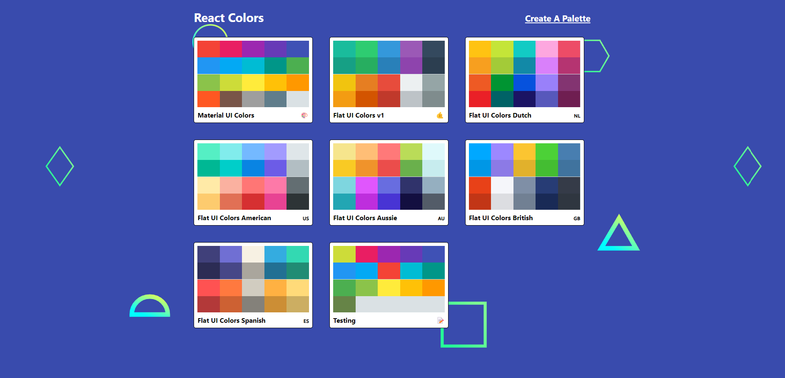
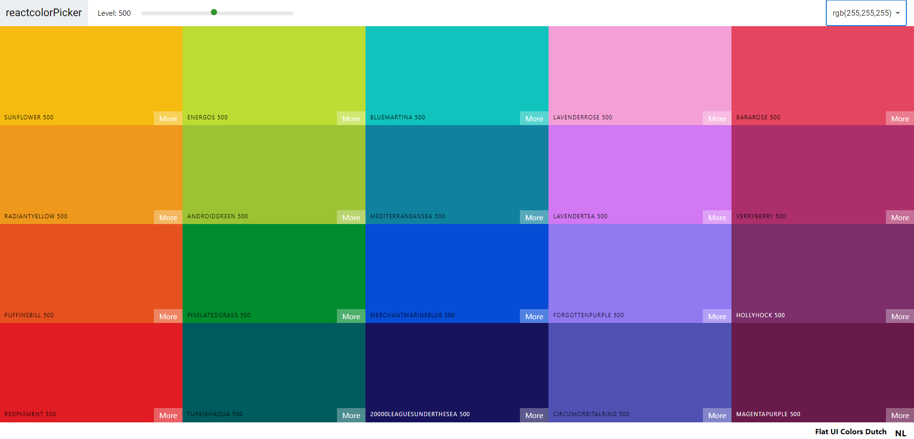

**Project Title: React-Colors - Custom Color Palette Generator**

**Overview:**
React Colors is a user-friendly web application that empowers designers and developers to create, manage, and customize their own color palettes. Whether you need inspiration for your next project or want to organize your favorite hues, React Colors has got you covered. With a range of powerful features, it's a versatile tool for anyone working with colors in web development.

### **Visual Overview**

For visualization representation.

### HomePage

### Pre-Built Color Palette

### Create Custom Color Palette Dashboard

**Key Features:**

1. **Create Custom Color Palettes:** React Colors allows you to easily create your own color palettes from scratch. Add your favorite colors, name them, and save them for later use.

2. **Manage Colors:** Tired of digging through endless lists of colors? Not anymore! React Colors provides an intuitive interface to organize and manage your colors efficiently.

3. **Copy Colors in Different Formats:** Need a color in HEX, RGB, or HSL format? React Colors lets you copy your selected color in various formats, making it seamless to use them in your projects.

4. **Explore Different Hues:** Finding the perfect shade is effortless with React Colors. Use the hue slider to experiment with different color variations and select the one that fits your design vision.

5. **Save Colors for Future Projects:** Found a stunning color combination? Save it to your collection to use it later in other projects.

6. **Delete Colors:** Want to remove a color from your palette? React Colors offers a straightforward option to delete colors you no longer need.

7. **Random Color Generator:** Feeling indecisive? Let React Colors inspire you! Generate random colors and create a color palette from them. It's a fun way to explore unique combinations for your future projects.

**Why Choose React Colors:**

- **User-Friendly:** The application boasts an intuitive user interface, making it easy for both beginners and experienced designers to navigate and create beautiful palettes.

- **Time-Saving:** React Colors streamlines the color selection process, allowing you to focus on your design rather than spending time searching for the right colors.

- **Cross-Platform:** Access React Colors from any device with an internet connection. It is responsive and works seamlessly on desktops, tablets, and smartphones.

- **Inspiration at Your Fingertips:** Whether you're starting a new project or just looking for fresh ideas, the random color generator is a helpful feature to spark your creativity.

- **Personalization:** Your color palettes are saved locally, so you can come back to them whenever you need. Create a library of your favorite colors and access them with ease.

**Conclusion:**

React Colors is your go-to tool for creating and managing custom color palettes for web development projects. With its array of features, including color format conversion, hue exploration, and random color generation, it offers both practicality and creativity. Simplify your color workflow and enhance your design projects with React Colors, the ultimate color palette generator. Start exploring the world of colors today!